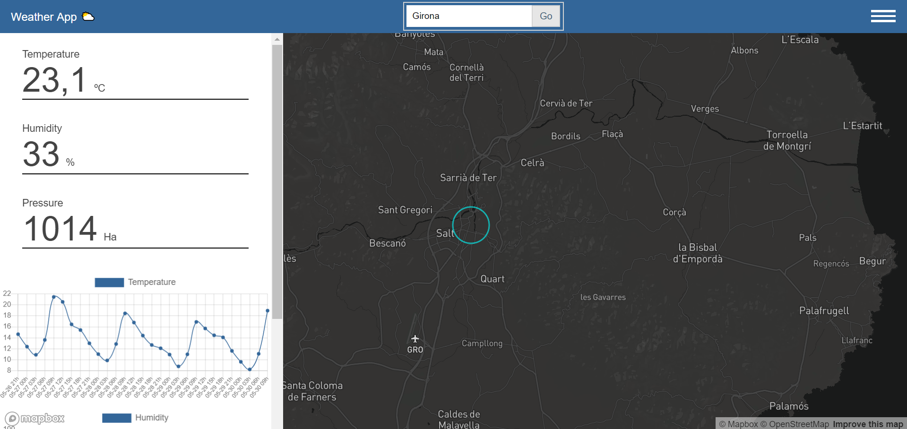

# Jornadas-SIG-libre-Girona-2019
A step-by-step guide on how to develop the main target of this seminar => A web weather dashboard development ⛅️



## Technologies
- [Axios](https://github.com/axios/axios)
- [ChartJS](https://www.chartjs.org/)
- [Mapbox GL JS](https://docs.mapbox.com/mapbox-gl-js/api/)
- [RequireJS](https://requirejs.org/)

We're going to use RequireJS to load the JavaScript files, it's a framework to manage dependencies between JavaScript files, it will improve the speed and quality of the app. We'll write the full code in Vanilla, so we won't use compilers like Webpack; as long as we don't use any framework here, RequireJS is a great tool to work with.

Using a maps library like Mapbox GL JS we get the whole WebGL power to render the maps, that's great!

ChartJS is a simple library to create charts as html canvas, we'll feed the charts with the OpenWeather fetched data.

---

## Data
The [OpenWeatherMap](https://openweathermap.org/) is a simple, fast and free weather API that brings you have access to current weather data. To start fetching data from there, you will'll need an [API key](https://openweathermap.org/appid#get)

---

## Directory Structure

```bash
├── app
│   ├── config.js
│   ├── fetchData.js
│   ├── main.js
│   ├── state.js
│   └── utils.js
├── lib  
│   ├── axios.min.js
│   ├── chart.min.js
│   ├── circle.js
│   ├── customChart.js
│   ├── mapbox-gl.js
│   └── require.js
├── styles
│   ├── UI-elements
│   │   ├── burger.css
│   │   ├── header.css
│   │   ├── sidebar.css
│   │   ├── inputText.css
│   │   └── indicators.css 
│   ├── style.css
│   └── mapbox-gl.css 
├── app.js
└── index.html
```

---

## Step by step app development 

### Step 1: Link RequireJS & the main stylesheet

- Download the app simple structure and reference 'style.css' and 'require.js' on your index.html

```html
<!DOCTYPE html>
<html>
    <title>⛅️ Weather App</title>
    <meta name="viewport" content="width=device-width, initial-scale=1.0">
    <meta charset="UTF-8">
    <head>
        <link href='styles/style.css' rel='stylesheet' />
        <script data-main="app" src="lib/require.js"></script>
    </head>
    <body>
    </body>
</html>

```
- Go to 'style.css' file and import the 'mapbox-gl.css' file

```css
@import 'mapbox-gl.css';
```

### Step 2: Set up the config file

- We're going to use a config file, in order to keep there some map properties. 
- Mapbox GL JS needs an access token to init, we use the public token provided for Mapbox. 
- Set the basemap you prefer.
- Config the center (long - lat) and the zoom.
- Set your API Key.
- Set the initial city.

```javascript
define(() => {
    return {
        mapbox_token: 'pk.eyJ1IjoiYWRyaXNvbGlkIiwiYSI6ImNqNWt4cGczNjJpZW0yd29kYnJxZXhsaHkifQ.Iq48zrXcmg_xE2kZAbxmEQ',
        basemap: 'mapbox://styles/mapbox/dark-v10?optimize=true',
        center: [6.1, 46.2],
        zoom: 10,
        weather_api_key: 'YOUR_API_KEY',
        initialCity: 'Girona'
    }
});
```

### Step 3: Map appears! 👽

- Let's create a map! Main.js file is the default file that RequireJS starts to work with (we defined this in our app.js file, see below), we'll use it as main javascript file, so we need to import the different libraries we're going to use there. 

```javascript
requirejs.config({
    baseUrl: 'lib',
    paths: {
        app: '../app'
    }
});

requirejs(['app/main']);

```
- Create a html div with 'map' id (or whatever you wanna name the container map) and add it to your 'body' tag
```html
<div id='map'></div>
```
- Give some styles to the map, fixed to the whole screen
```css
#map {
    position: absolute;
    height: 100%;
    width: 100%;
}
```
- Start importing with 'require()' method all the stuff we need.
- Set the Mapbox access token we just defined in our config file
- Init the map; then we pass some properties to the Map object: 'container' (usually a html div, let's grab our 'map' id), 'style' (the .pbf tile use it as a basemap defined in our config) and center & zoom (defined in our config as well). 
```javascript
define(require => {
    const mapboxgl = require('mapbox-gl');
    const Chart = require('chart.min');
    const customChart = require('customChart');
    const config = require('./config');
    
    mapboxgl.accessToken = config.mapbox_token;

    const map = new mapboxgl.Map({
        container: 'map',
        style: config.basemap,
        center: config.center,
        zoom: config.zoom
    });
});

```

### Step 4: UI element => Header
- Add the 'header' html tab into your 'body' tag
```html
<header>
    <div>Weather App ⛅️</div>
</header>
```
- Go to 'header.css' and set some styles 👨‍🎨
```css
header {
    position: fixed;
    z-index: 1;
    width: 100%;
    height: 3rem;
    background-color: rgb(51, 102, 153);
    color: white;
    display: -webkit-flex;
    display: flex;
    -webkit-flex-direction: row;
    flex-direction: row;
    -webkit-justify-content: space-between;
    justify-content: space-between;
    -webkit-align-items: center;
    align-items: center;
}

header > div {
    margin: 0 1rem 0 1rem;
}

header .header-items {
    display: -webkit-flex;
    display: flex;
    -webkit-flex-direction: row;
    flex-direction: row;
    -webkit-align-items: baseline;
    align-items: baseline;
}

@media (max-width: 600px) {
  header .header-title {
     display: none;
  }
}
```

### Step 5: UI element => Sidebar
- Let's create a div tag as a sidebar; put it in your 'body' tag. The sidebar will contains some indicators and the charts
```html
<div id="sidebar-node" class='sidebar sidebar-mb'>
</div>
```
- Go to 'sidebar.css' and set some styles 👨‍🎨
```css
.sidebar {
    position: fixed;
    z-index: 1;
    width: 400px;
    height: 100%;
    top: 3rem;
    left: 0;
    display: -webkit-flex;
    display: flex;
    -webkit-flex-direction: column;
    flex-direction: column;
    -webkit-justify-content: space-around;
    justify-content: space-around;
    overflow-y: auto;
    background-color: white;
    transition-duration: 1.5s;
}

.close {
  -webkit-transform: translate(-400px);
  transform: translate(-400px);
  transition-duration: 1.5s;
}

@media (max-width: 600px) {
  .sidebar-mb {
    width: 100%;
  }
}

```

### Step 6: UI element => Indicators
- We decided to show in this example three weather indicators as a little panel: temperature, pressure and humidity. We will fetch the data from our Weather API later. Put the following html code into your 'sidebar' container:
```html
<div class='indicators-container indicators-container-mb'>
    <div class='indicator'>
        <div>Temperature</div>
        <div class='indicator-value-container'>
            <div id='temperature-indicator-value' class='indicator-value'>...</div>
            <div>ºC</div>
        </div>
    </div>
    <div class='indicator'>
        <div>Humidity</div>
        <div class='indicator-value-container'>
            <div id='humidity-indicator-value' class='indicator-value'>...</div>
            <div>%</div>
        </div>
    </div>
    <div class='indicator'>
        <div>Pressure</div>
        <div class='indicator-value-container'>
            <div id='pressure-indicator-value' class='indicator-value'>...</div>
            <div>Ha</div>
        </div>
    </div>
</div>
```
- Go to 'indicators.css' and set some styles 👨‍🎨 Try to be creative here! This widget probably in the first thing that the user looks at, should be at least a bit impressive!
```css
.indicators-container {
    margin-top: 18rem;
}

@media (max-width: 600px) {
  .indicators-container-mb {
    margin-top: 14rem;
  }
}

.indicators-container, .indicator {
    font-size: .9rem;
    color: rgb(68, 68, 68);
    display: -webkit-flex;
    display: flex;
    -webkit-flex-direction: column;
    flex-direction: column;
    -webkit-justify-content: space-between;
    justify-content: space-between;
    padding: 1rem;
}

.indicator-value-container {
    display: -webkit-flex;
    display: flex;
    -webkit-flex-direction: row;
    flex-direction: row;
    -webkit-align-items: baseline;
    align-items: baseline;
    border-bottom: 1px solid black;
}

.indicator-value {
    font-size: 3rem;
    margin-right: .5rem;
}

```

### Step 7: Create charts
- Let's create a [ES6 class](https://developer.mozilla.org/es/docs/Web/JavaScript/Referencia/Classes). We need to create 'n' charts from ChartJS, so make sense to create a class to manage it. A good practice is to comment and define what the class do, go to 'customChart.js', take a look and modify some default properties :tropical_fish:
```javascript
define('customChart', () => {
    class customChart {
        constructor(definition) {
            this._chart = null;
            this._canvas = definition.canvas;
            this._type = definition.type;
            this._labels = definition.labels;
            this._label = definition.label;
            this._data = definition.data;
            this._backgroundColor = definition.backgroundColor;
            this._borderColor = definition.borderColor;
            this._borderWidth = definition.borderWidth || 1;
            this._pointRadius = definition.pointRadius || 2;

            this._startup();
        }

        _startup() {
            this._chart = new Chart(document.querySelector(`#${this._canvas}`).getContext('2d'), { 
            type: this._type,
            data: { 
                labels: this._labels,
                datasets: [{  
                    label: this._label, 
                    backgroundColor: this._backgroundColor,
                    borderColor: this._borderColor,
                    borderWidth: this._borderWidth,
                    pointRadius: this._pointRadius,
                    fill: false,
                    data: this._data
                }] 
            }, 
            options: {
                scales: {
                    xAxes: [{
                        ticks: {
                            fontSize: 8
                        }
                    }],
                    yAxes: [{
                        ticks: {
                            fontSize: 10
                        }
                    }]
                }
            }
           });
        }

        update(newData) {
            this._chart.data.labels = newData.labels;
            this._chart.data.datasets[0].data = newData.data;
            this._chart.update();
        }
    }

    return customChart;
});

```
- We will fetch the data from our Weather API later in order to fill the chart. Put the following html code into your 'sidebar' container, let's create three charts:
```html
<div>
    <canvas id='temperature-container'></canvas>
</div>
<div>
    <canvas id='humidity-container'></canvas>
</div>
<div>
    <canvas id='pressure-container'></canvas>
</div>
``` 

### Step 8: UI element => Input
- The apps needs to get a city input. Adding a input html tag with type 'text' we can achieved. Let's add it in our header:
```html
<div class='input-container'>
    <input id="cityNode" class='text-box' value='Girona' placeholder='Enter a city...' />
    <button id="goToNode" class='go-button'>Go</button>
</div>
```
- Go to 'inputText.css' and style it!
```css
.input-container {
    display: -webkit-flex;
    display: flex;
    -webkit-flex-direction: row;
    flex-direction: row;
    border: 1px solid #d3d3d3;
    padding: .25rem;
}

.text-box {
    border: none;
    font-size: .8rem;
    padding: .5rem;
}
  
.go-button {
    border: 1px solid #d3d3d3;
    background:#e6e6e6;
    color:#405C78;
    cursor: pointer;
    width: 2.5rem;
}

.go-button:hover {
    background:#bfbfbf;
}
```

### Step 9: UI element => Burger button
- The sidebar needs to automatically open and close we the user fires a click event on it, so, let's create a simple burger button, put it in your heade tag:
```html
    <div id="burger-node" class="burger-container">
        <div class="bar1"></div>
        <div class="bar2"></div>
        <div class="bar3"></div>
    </div>
```
- Go to 'burger.css' and style it!
```css
.burger-container {
  cursor: pointer;
}

.bar1, .bar2, .bar3 {
  width: 35px;
  height: 3px;
  background-color: white;
  margin: 4px 0;
}
```
- Add some logic in your main.js
```javascript
document.querySelector('#burger-node').addEventListener('click', e => {
    document.querySelector('#sidebar-node').classList.toggle('close');
});
```

### Step 10: Weather API call 
- Let's call out target data. Take a look at 'fetchData.js' file. We are importing our config file and some utils as object functions. - - First we define a 'fetchData' async function, this will retrieve the data. 
- 'fetchAPIResponse' contains two conditions, depending on the request we wanna call, 'weather' or 'forecast' (API routes).
- With 'URL' function we get the target url, then we call 'fethData' with this argument.
- After that, if the call is 'OK', the app will fly to the city, will update the circle feature and will fill the indicators and charts.
- Keep in mind that 'config.cityCircle' is holdind a 'circle.js' instance.


```javascript
define(require => {
    const config = require('./config');
    const utils = require('./utils');
    const axios = require('axios.min');
    const URL = (type, city) => `https://api.openweathermap.org/data/2.5/${type}?q=${city}&units=metric&APPID=${config.weather_api_key}`

    const fetchData = async url => {
        try {
            const response = await axios.get(url);
            return response.data;
        } catch (e) {
            throw e;
        }
    }

    function fetchAPIResponse(type, city) {
        if (type === 'weather') {
            fetchData(URL('weather', city)).then(response => {
                let coords = response.coord;
                utils.flyTo(config.mapInstance, coords);

                config.cityCircle.update({
                    'type': 'Feature',
                    'geometry': {
                        'type': 'Point',
                        'coordinates': new Array(coords.lon, coords.lat)
                    }
                });

                let indicartors = response.main;
                utils.fillIndicator('temperature', indicartors.temp);
                utils.fillIndicator('humidity', indicartors.humidity);
                utils.fillIndicator('pressure', indicartors.pressure); 
            })
            .catch(e => { 
                alert('Please check the input.'); 
                console.warn(`External error: ${e}`); 
            });
        } else if (type === 'forecast') {
            fetchData(URL('forecast', city)).then(response => {
                let target = response.list.slice(1, 30);
                let days = target.map(d => `${d.dt_txt.slice(5, 13)}h`);

                let values = [...target.reduce((mp, o) => {
                    if (!mp.has(o.main)) mp.set(o.main, {...o.main});    
                    mp.get(o.main);
                    return mp;
                }, new Map).values()];

                utils.fillChart(config.temperatureChart, {
                    labels: days,
                    data: values.map(v => v.temp)
                });

                utils.fillChart(config.humidityChart, {
                    labels: days,
                    data: values.map(v => v.humidity)
                });

                utils.fillChart(config.pressureChart, {
                    labels: days,
                    data: values.map(v => v.pressure)
                });
            })
            .catch(e => { 
                alert('Please check the input.'); 
                console.warn(`External error: ${e}`); 
            });
        }
    }

    return fetchAPIResponse;
});
```

### Step 11: Fetching data & instanciating some stuff => Charts, Circle (Layer) 
- Our final main.js file should look like the code below.
- We instance 'customChart' (go to customChart.js and read the class description to get how to work with this custom object), then we set the instance as a new key in the config.js, this way we can access it from another file.
- Once the map in loaded, the call 'Circle', in order to add the blinking circle layer.
- 'getWeatherData' retrieves the data and update the whole app! :)

```javascript
define(require => {
    const mapboxgl = require('mapbox-gl');
    const Chart = require('chart.min');
    const customChart = require('customChart');
    const Circle = require('circle');
    const getWeatherData = require('./fetchData');
    const config = require('./config');
    const state = require('./state');
    
    mapboxgl.accessToken = config.mapbox_token;

    const map = new mapboxgl.Map({
        container: 'map',
        style: config.basemap,
        center: config.center,
        zoom: config.zoom
    });

    config.mapInstance = map;

    const temperatureChart = new customChart({
        canvas: 'temperature-container',
        type: 'line',
        labels: [0, 1, 2],
        label: 'Temperature',
        data: [10, 20, 15],
        backgroundColor: 'rgb(51, 102, 153)',
        borderColor: 'rgb(51, 102, 153)'
    });

    config.temperatureChart = temperatureChart;

    const humidityChart = new customChart({
        canvas: 'humidity-container',
        type: 'line',
        labels: [0, 1, 2],
        label: 'Humidity',
        data: [10, 20, 15],
        backgroundColor: 'rgb(51, 102, 153)',
        borderColor: 'rgb(51, 102, 153)'
    });

    config.humidityChart = humidityChart;

    const pressureChart = new customChart({
        canvas: 'pressure-container',
        type: 'line',
        labels: [0, 1, 2],
        label: 'Pressure',
        data: [10, 20, 15],
        backgroundColor: 'rgb(51, 102, 153)',
        borderColor: 'rgb(51, 102, 153)'
    });

    config.pressureChart = pressureChart;

    map.on('load', () => {
        const cityCircle = new Circle({
            map: map,
            coords: config.center
        });

        config.cityCircle = cityCircle;

         getWeatherData('weather', config.initialCity);
         getWeatherData('forecast', config.initialCity);
    })
    
    document.querySelector('#goToNode').addEventListener('click', () => {
        getWeatherData('weather', state.targetCity());
        getWeatherData('forecast', state.targetCity());
    });

    document.querySelector('#burger-node').addEventListener('click', e => {
        document.querySelector('#sidebar-node').classList.toggle('close');
    });
});

```
